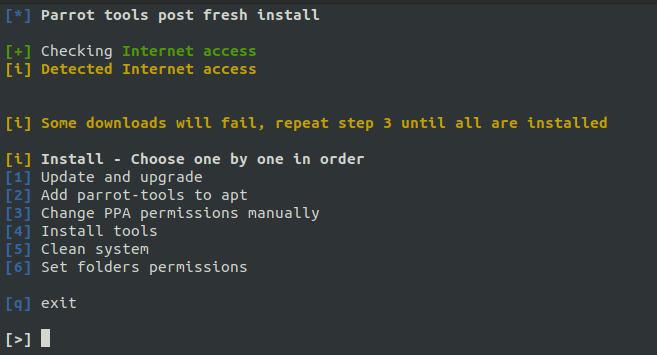

# ParrotSec-Tools-Installer
Installs PPA and commonly used tools from parrotOS in ubuntu.  
By following all steps you will have all tools available in parrot when using apt and be able to update tools with apt update and upgrade.

### **I strongly suggest you to test in a vm, before running... Your os might break**

# Why
This script is simply a personal script that installs some default tools like nmap, masscan, etc using parrotOS PPA, this is, adds the tools to apt and then apt installs them.

If you want to install all tools that parrotOS has, you should be able to simply do `sudo apt-get install parrot-tools-full` instead of step **4** (didn't test).

After step 3 you will have all parrot tools in apt, so you can install normally as if you were in parrotOS.

# How to use
To use this script follow all the steps one by one.  


Some downloads will fail when doing step **4**, just do step 4 again until all are installed.

# Step 3 is done manually
This must be done. If you upgrade without doing this, your system will break.

An example of the file `/etc/apt/preferences.d/parrot-pinning` will be:  
Where Parrot has a pin-priority lower than Debian and Ubuntu.
```bash
Package: *
Pin: release o=Parrot
Pin-Priority: 500

Package: *
Pin: release o=Debian
Pin-Priority: 700

Package: *
Pin: release o=Kali
Pin-Priority: 50

Package: *
Pin: release o=Ubuntu
Pin-Priority: 1001
```

# Tested on
+ Ubuntu 20.04

# Issues

if you get 404 error codes when trying to dist-upgrade, try to change the mirror in your `/etc/apt/sources.list.d/parrot.list` to one that has the files.
