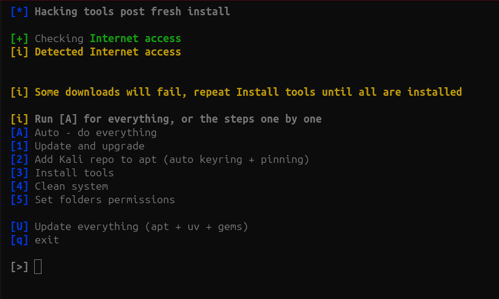

## Hacking-Tools-Installer
Installs commonly used offensive tools on a fresh Ubuntu, without installing the whole Kali.

Most tools come from Ubuntu's own repos. Python tools go through `uv`. The Kali repo is added too, but pinned low, so you can `apt install` any extra tool later without breaking the system.

**This script was made for a fresh Ubuntu**. If running on existing VM, I recommend doing a snapshot before. The pinning is built around a clean Ubuntu base, so run it on a new install, not on top of a system that already mixes other distro repos.

## Why
A personal script to turn a plain Ubuntu into a working pentest box: nmap, masscan, sqlmap, impacket, BloodHound, wordlists, etc. The idea is to avoid running full Kali but still have its tools one `apt install` away.

## How to use
Run as root. Pick `[A]` to do everything, or run the steps one by one.
```bash
sudo ./offensive-tools.sh
```


Some downloads may fail on "Install tools", just run it again until all are installed.

## Pick what to install
What gets installed is all in lists at the top of the script. Comment a line, or delete a word, to skip a tool:
+ `deps` / `tools` / `gems` for apt and ruby
+ `uvtools` for the python tools
+ `gotools` for the prebuilt go binaries
+ `install_bloodhound` / `install_ghidra` / `install_burp` to turn those on or off

Cloned tools and binaries go to `/opt/tools`, which is left owned by your user and added to your PATH, so you can drop more tools there yourself.

## About the Kali repo
The pinning keeps Kali **below** Ubuntu, so:
+ regular `apt update && apt upgrade` only touches Ubuntu packages
+ tools that only exist in Kali still install and upgrade
+ core libs (libc, libssl, systemd ...) are blocked from Kali, so a heavy tool fails clean instead of breaking the host

If a tool needs core libs newer than Ubuntu's, it won't install from apt, install it with `uv` or from git instead.

## uv
Python tools (impacket, theHarvester, netexec, certipy, etc.) go through [uv](https://github.com/astral-sh/uv) in your own user, in isolated envs (`pip` as root is blocked on modern Ubuntu).

Update everything (apt + uv + gems) with the `U` option in the menu.

## Extras
+ BloodHound CE is set up with docker through `bloodhound-cli`, it prints the admin password and the URL at the end
+ Ghidra is dropped into `/opt/tools` from the official release
+ Burp Community comes from the PortSwigger installer (bundles its own JRE, no system Java) into `/opt/tools`, for Pro grab it from the same place

## Tested on
+ Ubuntu 26.04
